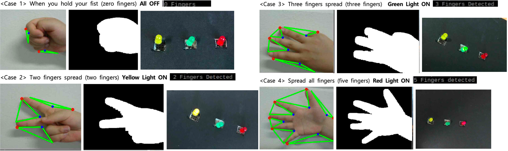

## Summary
Controlling lighting at home or work can be inconvenient due to the need to directly operate the switch. While some opt for controllers or smartphone apps for added convenience, this introduces the hassle of carrying a physical controller. Additionally, individuals who are unwell may face further difficulties.

In this project, we aim to implement a system capable of recognizing hand gestures to control lighting functions. The goal is to enable the control of lights, including on/off and various settings, without the need for direct physical interaction or the burden of carrying a separate controller.
