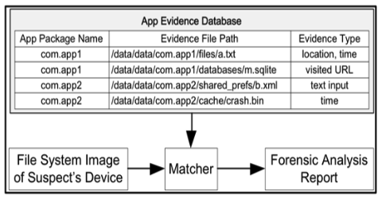

<!---

-->

## Summary
Recovering obfuscated Android applications is are big challenging issue in the research of Digital Forensic areas. 
Because most Android application developers generate their applications by implementing obfuscation techniques in order to avoid hackers or malicious users.  

In this project, I have tested obfuscated Android applications using recent tools FlowDroid, a static taint analysis tool for Android applications, and MiniDroid, a light version of FlowDroid that is time-efficient to generate call graphs.
MiniDroid achieves approximately 20% time reductions compared with FlowDroid and generates the exact same output even though Android applications are obfuscated with four different methods of obfuscation. 
