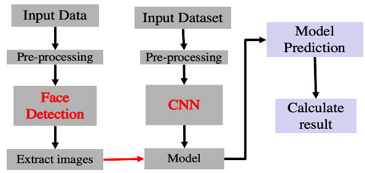

## Summary
Originally, for researchers in educational fields, the quality of learning for students at younger ages is important to improve their learning welfare. 
However, the number of national school closures worldwide has increased since the pandemic occurred, and our classes have become virtually not only for the universities but also the whole of elementary, middle, and high schools. 
Even if we get vaccinations for the virus and get better at dealing with COVID-19, virtually conducting lectures permeates our lives.
It is harder to figure out personal emotions through virtual meetings and learning than face-to-face classes. 
Thus, facial expressions can be essential in creating insightful measurements of student welfare through virtual meetings/lectures. 

Therefore, we apply the Convolutional Neural Network (CNN) to classify emotion by facial expressions in this project. Moreover, we tested those algorithms on actual virtual lecture environment data.
