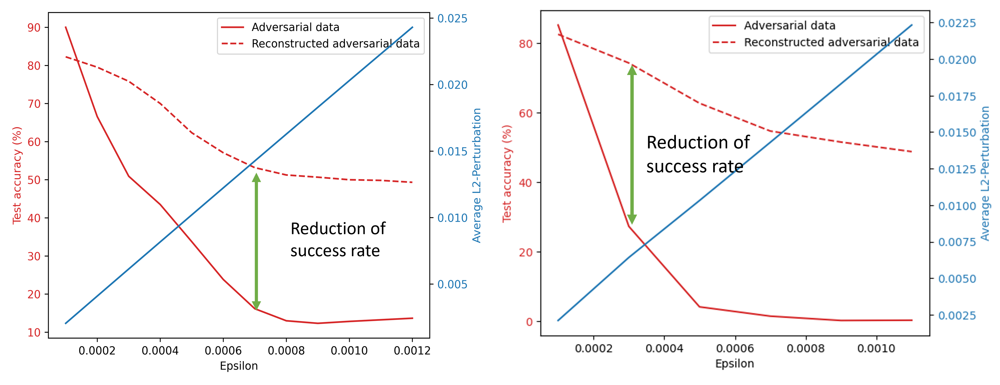

## Summary
In our project, we have successfully developed and demonstrated the effectiveness of our Dimensional Estimation(DE) tool leveraging Autoencoder, a Generative Learning model. Our focus is to enhance the understanding of dataset complexity through intrinsic dimension estimation and accurately determining the intrinsic dimensionality of diverse datasets. 
The strategic incorporation of various activation functions, ultimately setting on a 'linear' function on the Decoder layer. 
This ensures the preservation of intrinsic linear structures within the data to accurately capture meaningful features. 
We also utilized the Mean Square Error metric (MSE) for finding accurate dimension values on the datasets by investigating the knee point method. 
Identifying a characteristic knee point in the MSE curve demonstrates a robust indicator of optimal intrinsic dimensionality.

After DE Tool creation, we extended our project to the area of adversarial attacks on image datasets. 
Notably, adversarial attacks based on the Fast Gradient Sign Method(FGM) and Basic Iterative Method (BIM) caused a significant drop in classification accuracy from 99% to 16% and 20%, respectively. 

However, using our DE Tool exhibited remarkable resilience by achieving over 75% classification accuracy on the adversarial attack on the image dataset. 
Our project emphasizes the DE tool's efficacy in dimensional estimation and mitigation against adversarial threats.

For future developments, we suggest the incorporation of a pre-processing technique based on the Fast Fourier Transform (FFT) to strengthen our Dimensional Estimation (DE) Tool. 
Including this additional technique helps to enhance the overall robustness of our model and the reliability of our Dimensional Estimation Tool.

In summary, our project provides a comprehensive exploration of Dimensional Estimation utilizing Autoencoder, underscoring the inherent accuracy in determining intrinsic dimensions and the resilience against adversarial attacks. 
The integration of linear activation functions, the MSE metric, and the proposed pre-processing technique collectively position our DE Tool as a potent and adaptable solution for comprehending dataset complexity and defending against adversarial threats.
