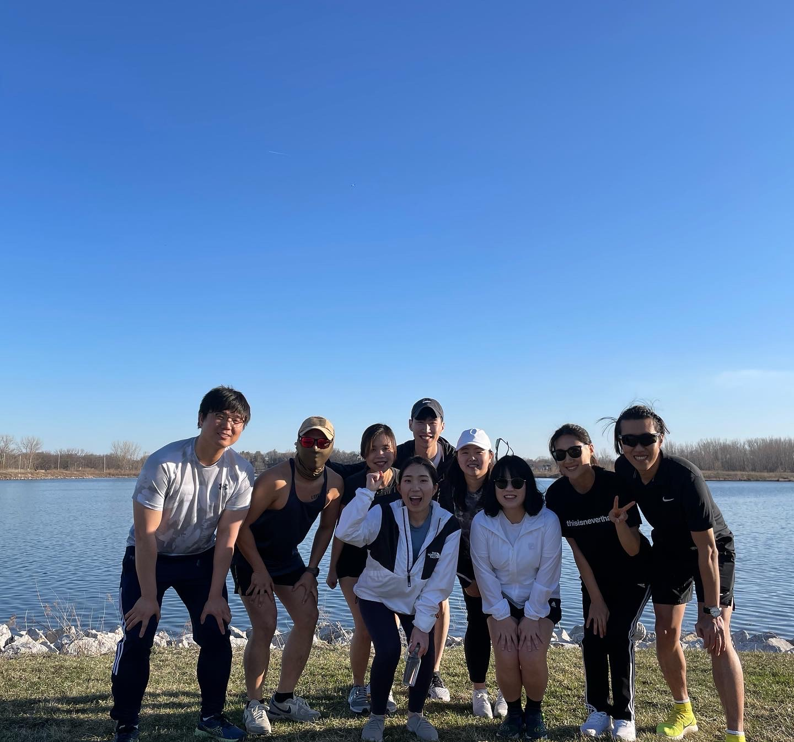
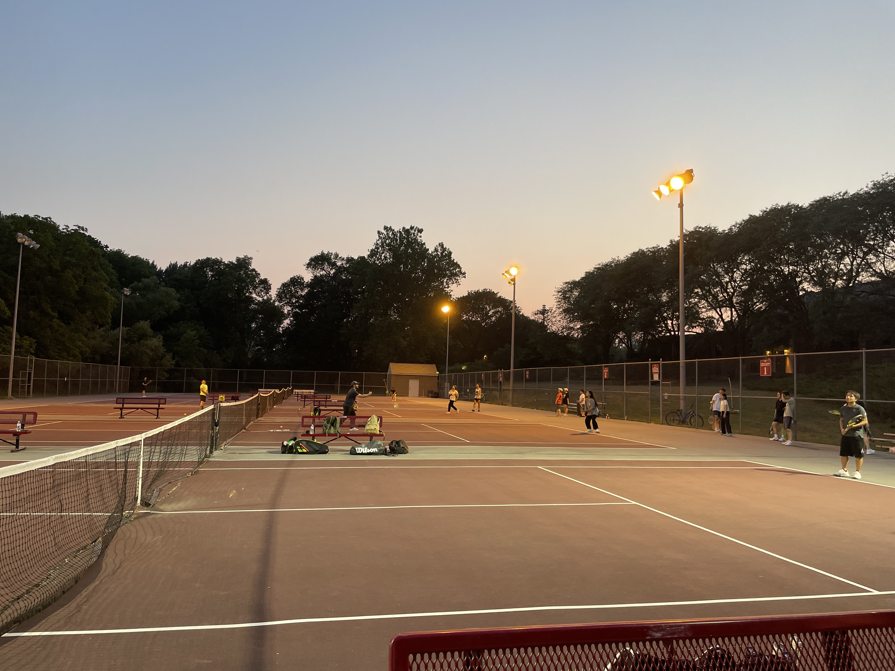

    

ɪғ ʏᴏᴜ ᴅᴏ ᴡʜᴀᴛ ʏᴏᴜ ʟᴏᴠᴇ, ʏᴏᴜ'ʟʟ ɴᴇᴠᴇʀ ᴡᴏʀᴋ ᴀ ᴅᴀʏ ɪɴ ʏᴏᴜʀ ʟɪғᴇ.

# About Me
**Seonghun Son** is currently a third-year Ph.D. candidate in Computer Engineering at Iowa State University <a href="https://www.ece.iastate.edu/bgulmez"><b>MAIS Lab</b></a> under Dr.Gulmezoglu. 
He completed his B.S. in Information and Communication Engineering from Yeungnam University, South Korea. 
Before joining Iowa State, he worked as an Assistant Manager at the ICT Infrastructure Strategy and Planning Team at the National Information Society Agency (NIA) in South Korea. 
His research interest is in Computer Architecture Security and Deep Learning. 
He is currently working on Microarchitectural attack detection using Deep Learning techniques, especially mitigations of side-channel attacks. 

# Education
* Jan. 2021 - **Present**: &nbsp; Ph.D Student in Electrical and Computer Engineering, **Iowa State University**
    * *<a href="https://www.ece.iastate.edu/bgulmez"><b>MAIS Lab</b></a>, Advisor : Prof. Berk Gulmezoglu*    

* Mar. 2012 - Feb. &nbsp; 2019: &nbsp; B.S in Information and Communication Engineering, **Yeungnam University**
    * *Awarded Academic Scholarships for three out of eight semesters*    

# Work Experience
* Sep. 2020 - Dec. 2020: &nbsp; National Information Society Agency, South Korea
    * *ICT Infrastructure Strategy and Planning Team*    

* Dec. 2018 - Oct. 2019: &nbsp; SL Corporation, South Korea
    * *Functional Safety Team, Electronics R&D Center*    

* Jan. 2016 - Feb. 2019: &nbsp; Data Communication Lab, Yeungnam University
    * *Undergraduate research student (Advisor: Prof. Jin-Ghoo, Choi)*    

# Project
[7] **Seonghun Son**, Yong Guan. “Recovering Obfuscation: Forensic technique of Obfuscated Android Applications”,  
 *Iowa State University CPRE 536: Digital and Network Forensic Course Project*  

[6] **Seonghun Son**, Hongyang Gao. “Facial Emotions Classification to improve the Welfare of virtual learning”,   
 *Iowa State University COMS 573:Machine Learning Course Project*  
 
[5] **Seonghun Son**, Jin-Ghoo Choi. “Controlling Light by Gesture Detection”,
*Enhanced Capstone Design Project with Utosys*  

[4] **Seonghun Son**, Hyojin Lim, Jin-Ghoo Choi. “Night Collision Avoidance system by detection of forwarding vehicles in drive lane”,
*Undergraduate Thesis*  

[3] Sunghyun Lee, Soonho Shin, **Seonghun Son**, Hoyoul Jung. “Vehicle crash avoidance systems based on rear lamp detection”,
*International Exploration of Engineering Education and CDP, January 2017, Hong Kong (Presenter)*  

[2] Muhammad Shafiq, Jin-Choo Choi, **Seonghun Son**, Heejung Yu. “CR-MEGA: Mutually Exclusive Guaranteed Access Control for Cognitive Radio Networks”, 
*Future Technologies Conference (FTC), pp. 89-96, November 2017, Vancouver, Canada.*  

[1] Sunghyun Lee, Soonho Shin, **Seonghun Son**, Hoyoul Jung. "Vehicle crash avoidance systems based on rear lamp detection",
*<a href="https://www.ece.iastate.edu/bgulmez](http://www.spcom.ecei.tohoku.ac.jp/JCK-WS2016/cfp.html"><b>2016 International Workshop on Emerging, ICT,</b></a> Sendai, Japan, October 2016 (Presenter)*   

# Extra Experience
* Jan. 2018 - Feb. 2018: &nbsp; Outbound Pilot Program, Yeungnam University
    * *Visiting Google, Facebook, Instagram, UCB, Standford, UCLA and UCI*    

* May. 2013 - May. 2015: &nbsp; Military Service, Republic of Korea Air Fore (11th Fighter Wing)
    * *Electic power operation in Air Force Tower*    

* Jan. 2008 - Dec. 2008: &nbsp; Awatapu College, *Palmerston North, New Zealand*
    * *NCEA Level 1 Certified*    
 
* Mar. 2000 - Dec. 2000: &nbsp; Glen Ackers Elementary School, *Indiana State, USA*    

# Volunteer
* May. 2021 - **Present**: &nbsp; CyMath 1.0, CyMath 2.0, CyMath 3.0 Iowa State University
    * *Mathematics volunteering program led by Dr. Namrata Vaswani*    

* Jul. 2017 - Aug. 2017: &nbsp; Team Leader, World Friend ICT Volunteer, *Can Tho University Technology, Vietnam*
    * *Teaching Programming Language and Korean Culture*    

* Jan. 2017 - Jan. 2017: &nbsp; Team Leader, Educational Service, *Myeongdeok Elementary School, South Korea*
    * *Teaching Science class (Korean Student Aid Foundation)*    

* Jul. 2016 - Jul. 2016: &nbsp; Educational Service, *Chengdo Area, South Korea*
    * *Psychological counseling program for student*    
   

* Jan. 2016 - Jan. 2016: &nbsp; Educational Service, *Hamchang Middle School, South Korea*
    * *Teaching Science / IT (Korean Foundation for the Advancement of Science & Creativity)*    
 
* Jul. 2016 - Jul. 2016: &nbsp; Korean Student Ambassador, *Korean American Friendship Circle, Team 19*    

# Personal Stuff
<!--  

-->
  



# People around the world

<!-- 
## Features
* Minimal, you can focus on your content
* Responsive
* Disqus integration
* Syntax highlighting
* Optional post image
* Social icons
* Page for sharing projects
* Optional background image
* Simple navigation menu
* MathJax support

## Preview


    https://cloud.githubusercontent.com/assets/754514/14509720/61c61058-01d6-11e6-93ab-0918515ecd56.png
    https://cloud.githubusercontent.com/assets/754514/14509716/61ac6c8e-01d6-11e6-879f-8308883de790.png




See a [live version of Moon](http://taylantatli.github.io/Moon) hosted on GitHub.

## Getting Started

To learn how to install and use this theme check out the [Setup Guide](http://taylantatli.me/Moon/moon-theme/) for more information.
      
[Install Moon](https://github.com/TaylanTatli/Moon){: .btn}

-->
